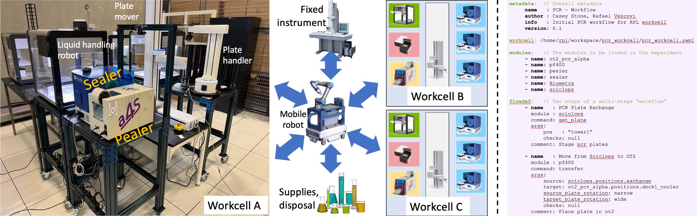
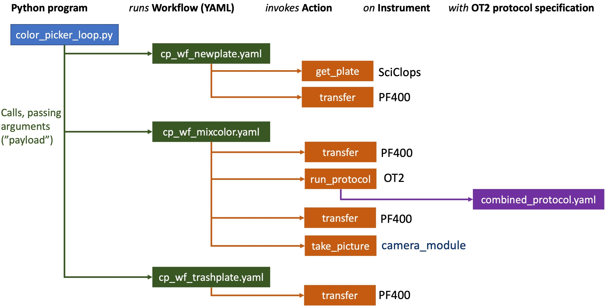
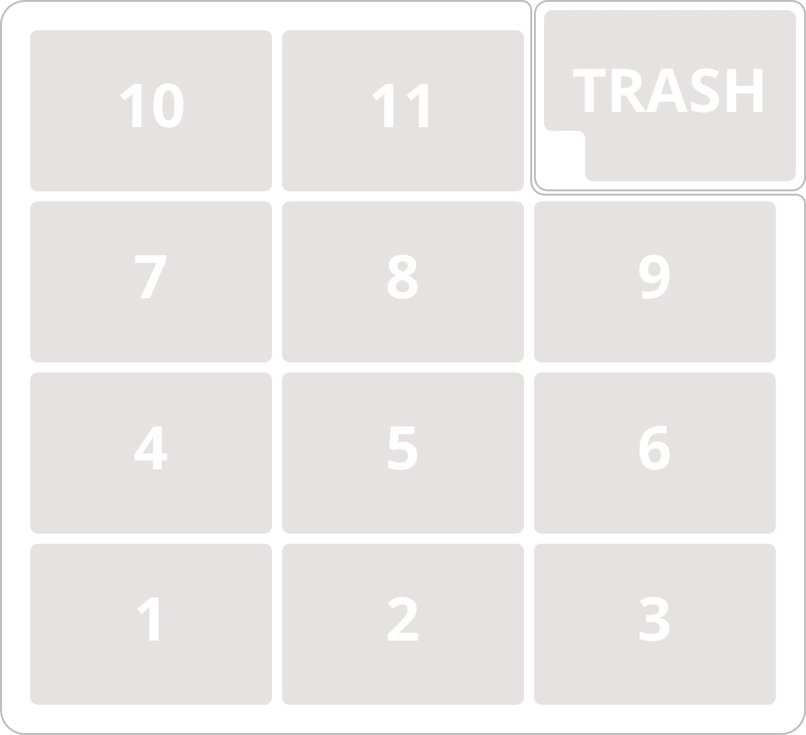

=======================
Introduction to RPL WEI
=======================

WEI is a Python-based tool designed to automate and manage workflows in a modular workcell environment.
This tool leverages ROS (Robot Operating System) for inter-module communication and FuncX, a 
function-as-a-service platform, for distributed computation. It is particularly geared towards managing 
complex workflows in scientific research and laboratory environments.

WEI allows you to define workflows in YAML format. Each workflow comprises a sequence of actions 
(commands), each performed by a specific module. A module represents an individual hardware or 
software component in the workcell. This modular approach provides the flexibility to design and 
implement diverse workflows across a variety of domains. 

Overview and Terminology
======================

We define conventional hardware and software configurations for robotic equipment and control software in order to simplify the assembly, modification, and scaling of experimental systems. The following figure shows our hardware conventions:

* A **cart** is a cart with zero or more modules 
* A **module** is an hardware component with a name, type, position, etc. (e.g., Pealer, Sealer, OT2 liquid handling robot, plate handler, plate mover, camera)
* A **workcell**, as show on the left of the image, is formed from multiple (8 in the photo on the left) carts that typically hold multiple modules (12 in the example, as described below).
* Multiple workcells and other components can be linked via mobile robots

A **workcell definition** (a YAML file, see below) defines the modules that comprise a workcell, and associated static infrastructure that are to be used by the workflow.

The software associated with a workflow is then defined by three types of files:
* A **driver program**, in Python, sets up to call one or more workflows
* A **workflow definition**, in YAML, define a set of **actions** to be executed, in order, on one or more of the modules in the workcell
* A **protocol definition**, in YAML, defines a set of steps to be performed, in order, on a specified OpenTrons OT2

The figure illustrates the three components for a simple "Color Picker" application that we use to illustrate the use of the technology. 

Workcell definition
------------------

A workcell definition is a YAML file (e.g., `pcr_workcell.yaml <https://github.com/AD-SDL/rpl_workcell/blob/main/pcr_workcell/pcr_workcell.yaml>`_) comprising two sections, *config* and *modules*:

The **config** section defines various infrastructure services that may be used elsewhere in the workcell. For example, here is the config from the example just listed.

.. code-block:: yaml

  ros_namespace: rpl_workcell                                 # ROS variable namespace name
  funcx_local_ep: "299edea0-db9a-4693-84ba-babfa655b1be"      # UUID for funcX endpoint used for local computations
  globus_local_ep: ""                                         # 
  globus_search_index: "aefcecc6-e554-4f8c-a25b-147f23091944" # UUID for the Globus Search instance
  globus_portal_ep: "bb8d048a-2cad-4029-a9c7-671ec5d1f84d"    # UUID for the portal to which data may be published
  globus_group: "dda56f31-53d1-11ed-bd8b-0db7472df7d6"        # 

The **modules** section lists the *modules* that are included in the workcell. In the example just listed, there are 12 in total: 

* a `pf400 sample handler <https://preciseautomation.com/SampleHandler.html>`_ (**pf400**) and two associated cameras, **pf400_camera_right** and **pf400_camera_left**; 
* a `SciClops plate handler <https://hudsonrobotics.com/microplate-handling-2/platecrane-sciclops-3/>`_ (**sciclops**)
* a `A4S <https://www.azenta.com/products/automated-roll-heat-sealer-formerly-a4s>`_ (**sealer**) and a `Brooks XPeel <https://www.azenta.com/products/automated-plate-seal-remover-formerly-xpeel>`_ (**peeler**), with an associated camera, **sp_module_camera**
* three `OpenTrons OT2 <https://opentrons.com/products/robots/ot-2/>`_ liquid handlers, **ot2_pcr_alpha**, **ot2_pcr_beta**, and **ot2_cp_gamma**;
* a `Biometra thermal cycler <https://www.analytik-jena.com/products/life-science/pcr-qpcr-thermal-cycler/thermal-cycler-pcr/biometra-trio-series/>`_ (**biometra**)
* another camera module, **camera_module**
           
For example, this module specification included in `pcr_workcell.yaml <https://github.com/AD-SDL/rpl_workcell/blob/main/pcr_workcell/pcr_workcell.yaml>`_ described the Sealer module:

.. code-block:: yaml
  - name: sealer                     # A name used for the module in the workflow: its "alias"
    type: wei_ros_node               # Indicates that module uses ROS2
    model: sealer                    # Not used at present
    config:
      ros_node: "/std_ns/SealerNode" # ROS2 network name (in name space)
    positions:                       # One or more spatial locations, with name 
      default: [205.128, -2.814, 264.373, 365.863, 79.144, 411.553]

The positions here refer to the joint angles the PF400 uses to reach a specific position on the cart. So the sealer default position defines the PF400 angles needed to place a plate on the sealer tray. 

For other modules, a module specification could include things like protocol and IP port.

Workflow definition
-------------------

This is specified by a YAML file that defines the sequence of actions that will be executed in order on the hardware. E.g., see `this example <https://github.com/AD-SDL/rpl_workcell/blob/main/color_picker/workflows/cp_wf_mixcolor.yaml>`_, shown also in the following, and comprising four sections:

* **metadata**: Descriptive metadata for the workflow
* **workcell**: The location of the workcell for which the workflow is designed
* **modules**: A list of the modules included in the workcell--four in this case.
* **flowdef**: A list of steps, each with a name, module, command, and arguments.

.. code-block:: yaml

    metadata:
    name: PCR - Workflow
    author: Casey Stone, Rafael Vescovi
    info: Initial PCR workflow for RPL workcell
    version: 0.1

    workcell: /home/rpl/workspace/rpl_workcell/pcr_workcell/pcr_workcell.yaml

    modules:
    - name: ot2_cp_gamma
    - name: pf400
    - name: camera

    flowdef:
    - name: Move from Camera Module to OT2
        module: pf400
        command: transfer
        args:
        source: camera_module.positions.plate_station
        target: ot2_cp_gamma.positions.deck2
        source_plate_rotation: narrow
        target_plate_rotation: wide
        comment: Place plate in ot2

    - name: Mix all colors
        module: ot2_cp_gamma
        command: run_protocol
        args:
        config_path:  /home/rpl/workspace/rpl_workcell/color_picker/protocol_files/combined_protocol.yaml
        red_volumes: payload.red_volumes
        green_volumes: payload.green_volumes
        blue_volumes: payload.blue_volumes
        destination_wells: payload.destination_wells
        use_existing_resources: payload.use_existing_resources
        comment: Mix the red portions according to input data

    - name: Move to Picture
        module: pf400
        command: transfer
        args:
        source: ot2_cp_gamma.positions.deck2
        target: camera_module.positions.plate_station
        source_plate_rotation: wide
        target_plate_rotation: narrow

    - name: Take Picture
        module: camera_module
        command: take_picture
        args:
        save_location: local_run_results
        file_name: "final_image.jpg"

This workflow uses three of 12 modules defined in the workcell definition earlier, **pf400**, **ot2_pcr_gamma**, and **camera_module**.
It comprises four steps:

* Transfer a plate from `camera_module.positions.plate_station` to `ot2_cp_gamma.positions.deck2`, while rotating the plate 90 degrees
* Run the "protocol" defined by the file `ot2_pcr_config.yaml <https://github.com/AD-SDL/rpl_workcell/blob/main/color_picker/protocol_files/combined_protocol.yaml>`_. This file specifies a sequence of steps to be performed on the hardware.

* Transfer the plate to the camera
* Take a picture of the plate

> While a workflow and a protocol both specify a sequence of actions to be performed, they are quite different in role and syntax. A **workflow** uses a hardware-independent notation to specify actions to perform on one or more modules (e.g., action A1 on module M1, action A2 on module M2); a **protocol** uses a hardware-specific notation to specify steps to be performed on a single module (e.g., OT2). Why *workflow* and *protocol*? Perhaps because this technology was developed by a partnership of computer scientists ("module", "workflow") and biologists ("protocol")
 
Protocol definition
--------------------

A protocol file gives the device-specific instructions to be executed on a specific piece of hardware to implement an intended action. For example, `ot2_pcr_config.yaml <https://github.com/AD-SDL/rpl_workcell/blob/main/pcr_workcell/protocol_files/ot2_pcr_config.yaml>`_ gives instructions for an OpenTrons OT2. A protocol file specifies a list of **equipment** within the hardware component; a sequence of **commands** to be executed on the equipment; and some describptive **metadata**. For example, the following shows the contents of `combined_protocol.yaml <https://github.com/AD-SDL/rpl_workcell/blob/main/color_picker/protocol_files/combined_protocol.yaml>`_, which comprise the equipment section, three commands, and the metadata section. 

Strings of the form *payload.VARIABLE* (e.g., `payload.destination_wells`) refer to arguments passed to the protocol.

The "location" argument here is OT2-specific: it indicates one of 11 plate locations, numbered 1..11:

An "alias" argument defines a string that can be used to refer to a position later in the specifrication: e.g., the fourth line in the YAML below specifies that location "7" can be referred to as "source". 

The wells within a plate are referred to via their column and row, e.g., A1. 

The following specification describes an OT2 with the following components:
* In location 7: A 6-well rack of 50 ml tubes. (These are used to contain the different colors that are to be mixed, in wells A1, A2, and A3.
* In each of locations 8 and 9: A 96-well rack of 300 ul wells.

.. code-block:: yaml

    equipment:
    - name: opentrons_6_tuberack_nest_50ml_conical
        location: "7"
        alias: source  # Define "source" as an alias for location 7
    - name: opentrons_96_tiprack_300ul
        location: "8"
    - name: opentrons_96_tiprack_300ul
        location: "9"

    commands:
    - name: Mix Color 1                       # Transfer fluid: A1 -> specified locations 
        source: source:A1
        destination: payload.destination_wells  # Destination wells for transfers (argument)
        volume: payload.red_volumes             # Volumes to be transferred  (argument)
        dispense_clearance: 2
        aspirate_clearance: 1
        drop_tip: False

    - name: Mix color 2
        source: source:A2
        destination: payload.destination_wells
        volume: payload.green_volumes
        dispense_clearance: 2
        aspirate_clearance: 1
        drop_tip: False    
    
    - name: Mix color 3
        source: source:A3
        destination: payload.destination_wells
        volume: payload.blue_volumes
        dispense_clearance: 2
        aspirate_clearance: 1
        mix_cycles: 3
        mix_volume: 100
        drop_tip: False

    metadata:
    protocolName: Color Mixing all
    author: Kyle khippe@anl.gov
    description: Mixing all colors
    apiLevel: "2.12"

Experiment Application
----------

A Python program defines the process required to run an experiment. E.g., see `color_picker_application.py <https://github.com/AD-SDL/rpl_workcell/blob/dev_tobias/color_picker/color_picker_application.py>`_ for a color picker program, which calls three workflows: 

* First, if needed, `cp_wf_newplate.yaml`
* Then, the workflow given above, `cp_wf_mixcolor.yaml`
* Finally, as needed, `cp_wf_trashplate.yaml`